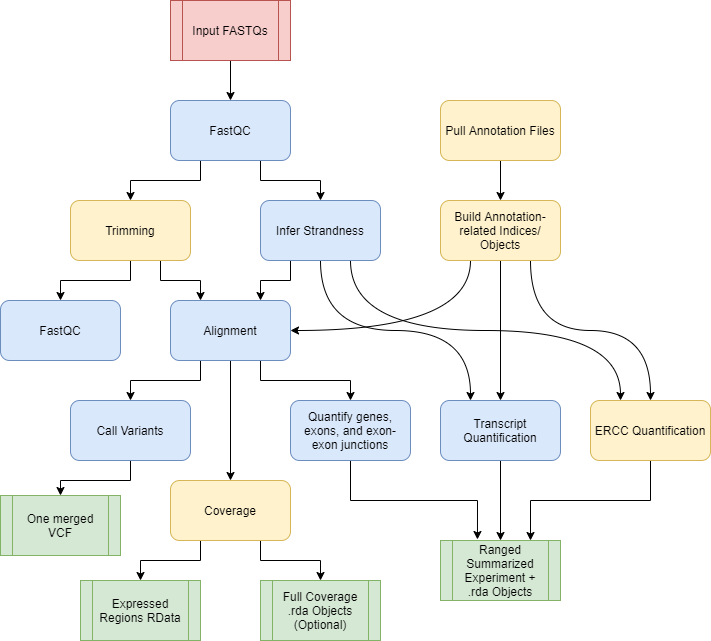
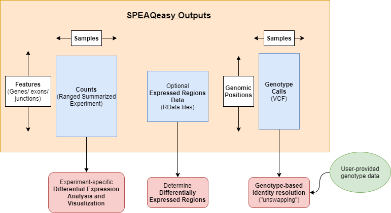

```{r setup, include = FALSE}
knitr::opts_chunk$set(
    collapse = TRUE,
    comment = "#>",
    crop = NULL ## Related to https://stat.ethz.ch/pipermail/bioc-devel/2020-April/016656.html
)
```


```{r vignetteSetup, echo=FALSE, message=FALSE, warning = FALSE}
## Track time spent on making the vignette
startTime <- Sys.time()

## Bib setup
library("RefManageR")

## Write bibliography information
bib <- c(
    R = citation(),
    BiocStyle = citation("BiocStyle")[1],
    knitr = citation("knitr")[1],
    rmarkdown = citation("rmarkdown")[1],
    sessioninfo = citation("sessioninfo")[1],
    SPEAQeasyWorkshop2020 = citation("SPEAQeasyWorkshop2020")[1],
    SPEAQeasy = citation("SPEAQeasyWorkshop2020")[2],
    clusterProfiler = citation("clusterProfiler"),
    edgeR = citation("edgeR"),
    here = citation("here"),
    jaffelab = citation("jaffelab"),
    limma = citation("limma"),
    org.Hs.eg.db = citation("org.Hs.eg.db"),
    pheatmap = citation("pheatmap"),
    R = citation(),
    RColorBrewer = citation("RColorBrewer"),
    rmarkdown = citation("rmarkdown"),
    recount = citation("recount"),
    RefManageR = citation("RefManageR")[1],
    SummarizedExperiment = citation("SummarizedExperiment"),
    tidyr = citation("tidyr")[1],
    VariantAnnotation = citation("VariantAnnotation")[1],
    voom = RefManageR::BibEntry(
        "article",
        key = "voom",
        author = "CW Law and Y Chen and W Shi and GK Smyth",
        year = "2014",
        title = "Voom: precision weights unlock linear model analysis tools for RNA-seq read counts",
        journal = "Genome Biology",
        volume = "15",
        pages = "R29"
    )
)
```

# Overview

This workshop aims to describe the `SPEAQeasy` `r Citep(bib[["SPEAQeasy"]])` RNA-seq processing pipeline, show how to use it, and then illustrate how the results can be analyzed using Bioconductor R packages for differential expression analyses.

SPEAQeasy is a [Nextflow](https://www.nextflow.io/)-based **S**calable RNA-seq processing **P**ipeline for **E**xpression **A**nalysis and **Q**uantification that produces R objects ready for analysis with Bioconductor tools. Partipants will become familiar with SPEAQeasy set-up, execution on real data, and practice configuring some common settings. We will walk through a complete differential expression analysis, utilizing popular packages such as [limma](https://www.bioconductor.org/packages/limma), [edgeR](http://bioconductor.org/packages/edgeR), and [clusterProfiler](https://bioconductor.org/packages/clusterProfiler).

## Instructors

* [Nick Eagles](https://github.com/Nick-Eagles)
* [Josh Stolz](https://github.com/joshstolz)
* [Leonardo Collado-Torres](http://lcolladotor.github.io/)

## Pre-requisites

* Basic understanding of RNA-seq
* Basic familiarity with the `SummarizedExperiment` and `GenomicRanges` packages

## Workshop Participation

This workshop makes use of two sets of files: the [SPEAQeasy GitHub repository](https://github.com/LieberInstitute/SPEAQeasy) and the workshop-specific files. You can clone the SPEAQeasy repository with:

```{bash, "clone", eval=FALSE}
git clone git@github.com:LieberInstitute/SPEAQeasy.git
```

The workshop-specific files include example outputs from SPEAQeasy, for performing a differential expression analysis. You can download a Docker image with these files using:

```bash
docker run -e PASSWORD=bioc2020 -p 8787:8787 -d --rm lcollado/speaqeasyworkshop2020
```

Then, log in to RStudio at [http://localhost:8787](http://localhost:8787) using username `rstudio` and password `bioc2020`. Note that on Windows you need to provide your localhost IP address like `http://191.163.92.108:8787/` - find it using `docker-machine ip default` in Docker's terminal.

To see the vignette on RStudio's window (from the docker image), run `browseVignettes(package = "SPEAQeasyWorkshop2020")`. Click on one of the links, "HTML", "source", "R code". In case of `The requested page was not found` error, add `help/` to the URL right after the hostname, e.g., [http://localhost:8787/help/library/SPEAQeasyWorkshop2020/doc/SPEAQeasyWorkshop2020.html](http://localhost:8787/help/library/SPEAQeasyWorkshop2020/doc/SPEAQeasyWorkshop2020.html). This is a [known bug](https://github.com/rocker-org/rocker-versioned/issues/178).


## Time outline

| Activity                     | Time |
|------------------------------|------|
| General overview of SPEAQeasy                                   | 20m  |
| Hands-on: configuring and running SPEAQeasy on real data        | 25m  |
| Understanding SPEAQeasy outputs                                 | 15m  |
| Differential expression analysis                                | 30m  |

Total: a 90 minute session.

## Workshop goals and objects

### Learning goals

- Understand what SPEAQeasy is and how it can fit into a complete RNA-seq processing workflow
- Become familiar with running SPEAQeasy on real input data
- Understand SPEAQeasy outputs and the Bioconductor packages available for different analysis goals
- Get concrete experience with an example differential expression analysis given SPEAQeasy output data

## Citing `SPEAQeasy`

We hope that `SPEAQeasy` `r Citep(bib[["SPEAQeasy"]])` will be useful for your research. Please use the following information to cite the package and the overall approach. Thank you!

```{r "citation"}
## Citation info
citation("SPEAQeasyWorkshop2020")[2]
```


# Workshop

## Introduction

### SPEAQeasy Overview

We introduce [SPEAQeasy](https://github.com/LieberInstitute/SPEAQeasy), a **S**calable RNA-seq processing **P**ipeline for **E**xpression **A**nalysis and **Q**uantification, that is **easy** to install, use, and share with others. More detailed documentation is [here](http://research.libd.org/SPEAQeasy/).



### SPEAQeasy Outputs

SPEAQeasy produces [RangedSummarizedExperiment](https://bioconductor.org/packages/release/bioc/html/SummarizedExperiment.html) objects with raw and normalized counts for each feature type: genes, exons, exon-exon junctions, and transcripts.

For human samples, variant calling is performed at a list of highly variables sites. A single [VCF file](https://www.internationalgenome.org/wiki/Analysis/Variant%20Call%20Format/vcf-variant-call-format-version-40/) is generated, containing genotype calls for all samples. This estalishes a sufficiently unique profile for each sample which can be compared against pre-sequencing genotype calls to resolve potential identity issues.

Optionally, [BigWig](https://genome.ucsc.edu/goldenPath/help/bigWig.html) coverage files by strand, and averaged across strands, are produced. An additional step utilizes the [derfinder](https://bioconductor.org/packages/release/bioc/html/derfinder.html) package to compute expressed regions, a precursor to analyses finding differentially expressed regions (DERs).



### Installation and Set-up

First, clone the SPEAQeasy repository.

```{bash, eval=FALSE}
git clone git@github.com:LieberInstitute/SPEAQeasy.git
```

SPEAQeasy dependencies can be managed with docker, involving a fairly quick installation that is reproducible regardless of the computing environment. For those who are able to use docker, SPEAQeasy can be installed with:

```{bash, eval=FALSE}
#  From within the SPEAQeasy repository:
bash install_software.sh "docker"
```

If you do not have access to docker on your machine, SPEAQeasy can be installed with:

```{bash, eval=FALSE}
#  From within the SPEAQeasy repository:
bash install_software.sh "local"
```

Please note that installation with docker is recommended if available, and that "local" installation can take quite some time, as all dependencies are built from source. **Installing and running SPEAQeasy is not required for this workshop**, but is demonstrated to familiarize participants with the process. The workshop files include outputs from SPEAQeasy, which can be used later for the example differential expression analysis.

Choose a "main" script as appropriate for your particular set-up. "Main" scripts and associated configuration files exist for SLURM-managed computing clusters, SGE-managed clusters, local machines, and the [JHPCE](https://jhpce.jhu.edu/) cluster.

| Environment  | "Main" script | Config file |
|----------|-------------|-------------------|
| SLURM cluster   | run_pipeline_slurm.sh      | conf/slurm.config or conf/docker_slurm.config  |
| SGE cluster     | run_pipeline_sge.sh        | conf/sge.config or conf/docker_sge.config      |
| Local machine   | run_pipeline_local.sh      | conf/local.config or conf/docker_local.config  |
| JHPCE cluster   | run_pipeline_jhpce.sh      | conf/jhpce.config                              |

Within the main script, you can configure arguments specific to the experiment, such as the reference organism, pairing of samples, and where to place output files, among other specifications.

When running SPEAQeasy on a cluster (i.e. SLURM, SGE, or JHPCE users), it is recommended you submit the pipeline as a job, using the command appropriate for your cluster. For those running SPEAQeasy locally, the main script can be executed directly.

```{bash, eval=FALSE}
#  SLURM-managed clusters
sbatch run_pipeline_slurm.sh

#  SGE-managed clusters
qsub run_pipeline_sge.sh

#  local machines
bash run_pipeline_local.sh

#  The JHPCE cluster
qsub run_pipeline_jhpce.sh
```

Here's an example of such a file.

```{r "example_run_file"}
## Root for our example files
example_files <- system.file(
    "extdata",
    "SPEAQeasy-example",
    package = "SPEAQeasyWorkshop2020"
)

## Read in the actual bash script used to run SPEAQeasy with the
## data from SPEAQeasy-example
cat(paste0(readLines(
    file.path(example_files, "pipeline_outputs", "run_pipeline_jhpce.sh")
), "\n"))
```


### Examining SPEAQeasy outputs

Let's take a look at one of the major outputs from SPEAQeasy- the `RangedSummarizedExperiment` containing gene counts.

```{r "intro_pkgs", message=FALSE, warning=FALSE}
library("SummarizedExperiment")
library("jaffelab") # GitHub: LieberInstitute/jaffelab
```


```{r "examine_outputs"}
#  Load the RSE containing gene counts
load(
    file.path(
        example_files,
        "pipeline_outputs",
        "count_objects",
        "rse_gene_Jlab_experiment_n42.Rdata"
    ),
    verbose = TRUE
)

#  Print an overview
rse_gene

#  Check out the metrics SPEAQeasy collected for each sample, including stats
#  from FastQC, trimming, and alignment
colnames(colData(rse_gene))

#  View the "top left corner" of the counts assay, containing counts for a few
#  genes and a few samples
corner(assays(rse_gene)$counts)

#  Examine what data is provided in the RSE object for each gene ("row")
head(rowData(rse_gene))
```

## Identifying sample swaps

_Note: the original version is available [here](http://research.libd.org/SPEAQeasy-example/swap_speaqeasy.html) and was written by [Josh Stolz](https://github.com/joshstolz) and [Louise Huuki](https://github.com/lahuuki)._


```{r libraries, message = FALSE, warning = FALSE}
library("pheatmap")
library("tidyr")
library("VariantAnnotation")
```

In order to resolve the swaps to our best ability we need four data sets. Here we have load `snpGeno_example` which is from our TOPMed imputed genotype data, a phenotype data sheet (pd_example), a VCF file of the relevant SPEAQeasy output (SPEAQeasy), and our current genotype sample sheet (`brain_sentrix`). This file is available in the directory listed below.

```{r load_data, echo=TRUE}
load(file.path(example_files, "sample_selection", "snpsGeno_example.RData"),
    verbose = TRUE)
load(file.path(example_files, "sample_selection", "pd_example.Rdata"),
    verbose = TRUE)
Speaqeasy <-
    readVcf(
        file.path(
            example_files,
            "pipeline_outputs",
            "merged_variants",
            "mergedVariants.vcf.gz"
        ),
        genome = "hg38"
    )
brain_sentrix <-
    read.csv(file.path(example_files, "brain_sentrix_speaqeasy.csv"))
```

We can see that the genotype is represented in the form of 0s, 1s, and 2s. The rare 2s are a result of multiallelic SNPs and we will drop those. 0 represent the reference allele with ones representing the alternate. We can see the distribution below.

```{r explore_speaqeasy_speaqeasy, echo=TRUE}
Geno_speaqeasy <- geno(Speaqeasy)$GT
table(Geno_speaqeasy)
```

Given this we convert we convert the Genotype data from SPEAQeasy to numeric data. The `"./."` were values that could not accurately be determined and are replaced with `NA`.

```{r data_prep_speaqeasy, echo=TRUE}
colnames_speaqeasy <- as.data.frame(colnames(Geno_speaqeasy))
colnames(colnames_speaqeasy) <- c("a")
samples <-
    tidyr::separate(colnames_speaqeasy,
        a,
        into = c("a", "b", "c"),
        sep = "_"
    )
samples <- paste0(samples$a, "_", samples$b)
samples <- as.data.frame(samples)
colnames(Geno_speaqeasy) <- samples$samples
Geno_speaqeasy[Geno_speaqeasy == "./."] <- NA
Geno_speaqeasy[Geno_speaqeasy == "0/0"] <- 0
Geno_speaqeasy[Geno_speaqeasy == "0/1"] <- 1
Geno_speaqeasy[Geno_speaqeasy == "1/1"] <- 2
class(Geno_speaqeasy) <- "numeric"
corner(Geno_speaqeasy)
```

We then make a correlation matrix to find the possible mismatches between samples.

```{r cor_speaqeasy, echo=TRUE}
speaqeasy_Cor <- cor(Geno_speaqeasy, use = "pairwise.comp")
corner(speaqeasy_Cor)
```

Here in the heatmap below we can see that several points do not correlate with themselves in a symmetrical matrix. This could be mismatches, but it also could be a result of a brain being sequenced twice. We will dig more into this later on.

```{r check_correlations_speaqeasy, echo=FALSE}
pheatmap(
    speaqeasy_Cor,
    cluster_rows = FALSE,
    show_rownames = FALSE,
    cluster_cols = FALSE,
    show_colnames = FALSE
)
```

We repeat the process for the genotype data from TOPMed. First creating our numeric data for the genotypes.

```{r data_prep_genotypes, echo=FALSE}
names <- rownames(snpsGeno_example)
Geno_example <- geno(snpsGeno_example)$GT
table(Geno_example)
Geno_example[Geno_example == ".|."] <- NA
Geno_example[Geno_example == "0|0"] <- 0
Geno_example[Geno_example == "1|0"] <- 1
Geno_example[Geno_example == "0|1"] <- 1
Geno_example[Geno_example == "1|1"] <- 2
class(Geno_example) <- "numeric"
rownames(Geno_example) <- names
correlation_genotype <- cor(Geno_example, use = "pairwise.comp")
corner(correlation_genotype)
```

In this case the data only appears to have samples that match themselves. However there is the potential for a second kind of error where a brain has two samples, however the do not match each other. 

```{r check_correlations_genotypes, echo=FALSE}
pheatmap(
    correlation_genotype,
    cluster_rows = FALSE,
    show_rownames = FALSE,
    cluster_cols = FALSE,
    show_colnames = FALSE
)
```

We will next compare the correlation between the SPEAQeasy samples and the TOPMed samples. In order to do this we need to subset the genotypes for only SNPs that are common between the two. We can see that we have 662 snps common between the 42 samples.

```{r subset_genotype_data_sets}
Geno_speaqeasy_subset <-
    Geno_speaqeasy[rownames(Geno_speaqeasy) %in% rownames(Geno_example), ]
snpsGeno_subset <-
    Geno_example[rownames(Geno_example) %in% rownames(Geno_speaqeasy_subset), ]
dim(Geno_speaqeasy_subset)
dim(snpsGeno_subset)
```

As we did before we create a correlation matrix this time between the two data sets. 

```{r make_correlation_genotype_speaqeasy}
correlation_genotype_speaq <-
    cor(snpsGeno_subset, Geno_speaqeasy_subset, use = "pairwise.comp")
```

In order to dig into this further we will collapse the correlation matrices into a data table shown below.

```{r make_corlong3_table}
## Convert to long format
corLong3 <-
    data.frame(cor = signif(as.numeric(correlation_genotype_speaq), 3))
corLong3$rowSample <-
    rep(colnames(snpsGeno_example), times = ncol(snpsGeno_example))
corLong3$colSample <-
    rep(colnames(Geno_speaqeasy), each = ncol(Geno_speaqeasy))
```

Check the correlation between SPEAQeasy and Genotype for mismatches and swaps.

```{r check_mismatches}
brain_sentrix_present <-
    subset(brain_sentrix, ID %in% colnames(snpsGeno_example))

## Match across tables
speaqeasy_match_col <-
    match(corLong3$colSample, pd_example$SAMPLE_ID)
corLong3$colBrain <- pd_example$BrNum[speaqeasy_match_col]
brain_sentrix_match_row <-
    match(corLong3$rowSample, brain_sentrix_present$ID)
corLong3$rowBrain <-
    brain_sentrix_present$BrNum[brain_sentrix_match_row]

# Fails to match
corLong3[corLong3$rowBrain == corLong3$colBrain &
    corLong3$cor < .8, ]

# Mismatches
corLong3[!corLong3$rowBrain == corLong3$colBrain &
    corLong3$cor > .8, ]
```

We can see from this from this analysis there are a few swaps present between RNA and DNA samples here. We can categorize them as simple and complex sample swaps. Because the two Br2275 do not match each other and also match nothing else we will be forced to consider this a complex swap and drop the sample. In the case of Br2473 it is a simple swap with Br2260 in both cases. This can be amended by swapping with in the phenotype data sheet manually. Now we have our accurate data outputs and will need to fix our ranged summarized experiment object for our SPEAQeasy data.

```{r swap_pd_sheet}
## drop sample from rse with SPEAQeasy data
ids <- pd_example$SAMPLE_ID[pd_example$BrNum == "Br2275"]
rse_gene <- rse_gene[, !rse_gene$SAMPLE_ID == ids[1]]
rse_gene <- rse_gene[, !rse_gene$SAMPLE_ID == ids[2]]

# resolve swaps and drops in pd_example
pd_example <- pd_example[!pd_example$SAMPLE_ID == ids[1], ]
pd_example <- pd_example[!pd_example$SAMPLE_ID == ids[2], ]
ids2 <- pd_example$SAMPLE_ID[pd_example$BrNum == "Br2260"]
ids3 <- pd_example$SAMPLE_ID[pd_example$BrNum == "Br2473"]
pd_example$SAMPLE_ID[pd_example$Sample_ID == ids2] <- "Br2473"
pd_example$SAMPLE_ID[pd_example$Sample_ID == ids3] <- "Br2260"

# reorder phenotype data by the sample order present in the 'rse_gene' object
pd_example <-
    pd_example[match(rse_gene$SAMPLE_ID, pd_example$SAMPLE_ID), ]

# add important colData to 'rse_gene'
rse_gene$BrainRegion <- pd_example$BrainRegion
rse_gene$Race <- pd_example$Race
rse_gene$PrimaryDx <- pd_example$PrimaryDx
rse_gene$Sex <- pd_example$Sex
rse_gene$AgeDeath <- pd_example$AgeDeath

# add correct BrNum to colData for rse_gene
colData(rse_gene)$BrNum <- pd_example$BrNum
```

We can then save the gene counts with the resolved sample swaps.

```{r save_unswapped, eval = FALSE}
## You can then save the data
save(rse_gene, file = "rse_speaqeasy.RData")
```


## DE Analysis

In case that you skipped the previous section, you can load the data for the differential expression part with the following code.

```{r load_skipping, eval = FALSE}
## Root for our example files
example_files <- system.file(
    "extdata",
    "SPEAQeasy-example",
    package = "SPEAQeasyWorkshop2020"
)

## Load the file
load(file.path(example_files, "rse_speaqeasy.RData", verbose = TRUE))
```


```{r "start", message=FALSE, warning=FALSE}
library("clusterProfiler")
library("edgeR")
library("limma")
library("pheatmap")
library("org.Hs.eg.db")
library("RColorBrewer")
library("recount")
```

Edit this as you see fit =)

Here is an example of you can cite your package inside the vignette:

* `r Biocpkg("SPEAQeasyWorkshop2020")` `r Citep(bib[["SPEAQeasyWorkshop2020"]])`

# Acknowledgements

## Members of the (former) Jaffe Lab

- Emily Burke: much of the code for SPEAQeasy before it was re-built with Nextflow, including a great portion of the R scripts still used now
- Brianna Barry: guidance, naming, and testing SPEAQeasy, leading to features such as per-sample logs and automatic strand inference, among others
- Louise Huuki: help with our guide involving resolving sample swaps from SPEAQeasy outputs
- BaDoi Phan: development of the pipeline before using Nextflow
- Andrew Jaffe: principal investigator, leading and overseeing the SPEAQeasy project
- Leonardo Collado Torres: development, guidance, and help throughout the SPEAQeasy project; development of this workshop package and website

## Winter Genomics Team

Estlabished a foundation for the Nextflow-port (now SPEAQeasy) of the RNA-seq pipeline internally used by the Jaffe Lab.

- Jacob Leonard
- Violeta Larios Serrato

# Reproducibility

The `r Biocpkg("SPEAQeasyWorkshop2020")` package `r Citep(bib[["SPEAQeasyWorkshop2020"]])` was made possible thanks to:

* R `r Citep(bib[["R"]])`
* `r Biocpkg("BiocStyle")` `r Citep(bib[["BiocStyle"]])`
* `r Biocpkg('clusterProfiler')` `r Citep(bib[['clusterProfiler']])`
* `r Biocpkg('edgeR')` `r Citep(bib[['edgeR']])`
* `r CRANpkg('here')` `r Citep(bib[['here']])`
* `r Githubpkg('LieberInstitute/jaffelab')` `r Citep(bib[['jaffelab']])`
* `r Biocpkg('limma')` `r Citep(bib[['limma']])`
* `r CRANpkg("knitr")` `r Citep(bib[["knitr"]])`
* `r Biocpkg('org.Hs.eg.db')` `r Citep(bib[['org.Hs.eg.db']])`
* `r CRANpkg('pheatmap')` `r Citep(bib[['pheatmap']])`
* `r CRANpkg('RColorBrewer')` `r Citep(bib[['RColorBrewer']])`
* `r Biocpkg('recount')` `r Citep(bib[['recount']])`
* `r CRANpkg("RefManageR")` `r Citep(bib[["RefManageR"]])`
* `r CRANpkg("rmarkdown")` `r Citep(bib[["rmarkdown"]])`
* `r CRANpkg("sessioninfo")` `r Citep(bib[["sessioninfo"]])`
* `r Biocpkg('SummarizedExperiment')` `r Citep(bib[['SummarizedExperiment']])`
* `r CRANpkg("tidyr")` `r Citep(bib[["tidyr"]])`
* `r Biocpkg('VariantAnnotation')` `r Citep(bib[['VariantAnnotation']])`
* `r Biocpkg('voom')` `r Citep(bib[['voom']])`

This package was developed using `r BiocStyle::Githubpkg("lcolladotor/biocthis")`.


Code for creating the vignette

```{r createVignette, eval=FALSE}
## Create the vignette
library("rmarkdown")
system.time(render("SPEAQeasyWorkshop2020.Rmd", "BiocStyle::html_document"))

## Extract the R code
library("knitr")
knit("SPEAQeasyWorkshop2020.Rmd", tangle = TRUE)
```

Date the vignette was generated.

```{r reproduce1, echo=FALSE}
## Date the vignette was generated
Sys.time()
```

Wallclock time spent generating the vignette.

```{r reproduce2, echo=FALSE}
## Processing time in seconds
totalTime <- diff(c(startTime, Sys.time()))
round(totalTime, digits = 3)
```

`R` session information.

```{r reproduce3, echo=FALSE}
## Session info
library("sessioninfo")
options(width = 120)
session_info()
```


# Bibliography

This vignette was generated using `r Biocpkg("BiocStyle")` `r Citep(bib[["BiocStyle"]])`
with `r CRANpkg("knitr")` `r Citep(bib[["knitr"]])` and `r CRANpkg("rmarkdown")` `r Citep(bib[["rmarkdown"]])` running behind the scenes.

Citations made with `r CRANpkg('RefManageR')` `r Citep(bib[['RefManageR']])`.

```{r vignetteBiblio, results = "asis", echo = FALSE, warning = FALSE, message = FALSE}
## Print bibliography
PrintBibliography(bib, .opts = list(hyperlink = "to.doc", style = "html"))
```
